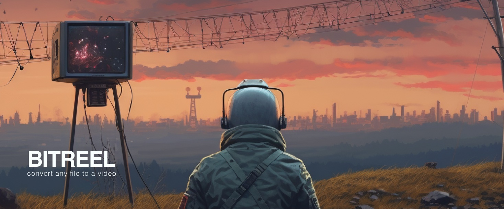
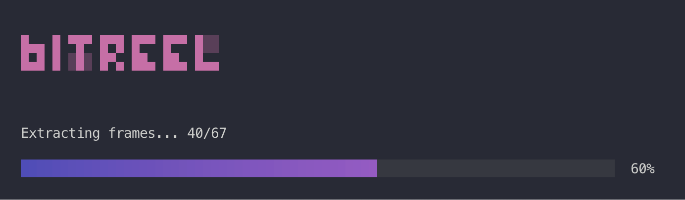
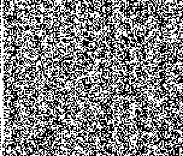

<br>
</a>
<br>

### Bitreel
Tool that converts any file to a video and back again.
So you can upload it a to video hosting and have an infinite* tape storage.


### How does it work?

Encoding file to a video is done by representing every bit as a black (1) or white (0) 2x2 pixels square.<br>
Due to this process, the resulting video will be approximately 4 times the size of your original file.<br>
A checksum for each frame is calculated and incorporated as metadata, ensuring the integrity of your data.<br>
The final step involves encoding these frames into a video using ffmpeg.<br>

### Metadata
In every frame included metadata containing original filename and date of encoding.<br>
Also it will include checksum and error correction data in future versions.

### Performance
Encoding and decoding is done in parallel using all available CPU cores.<br>


### Crop of the video frame
<div align="center">
<br>
<br>
<a href="https://github.com/1F47E/go-bitreel/blob/master/assets/out.png?raw=true">
    </a>
<br>
</div>


### Dependencies

```
brew install ffmpeg
```

### Install
```
brew tap 1F47E/homebrew-tap
brew install bitreel
```

### Usage

To encode a file
```
bitreel encode <file>
```

To decode a file
```
bitreel decode <file>
```


### DEV NOTES
encode images to video with image convert to yuv422p10
```
ffmpeg -framerate 30 -i out_%d.png -c:v prores -profile:v 3 -pix_fmt yuv422p10 output.mov
```

decode video to images
```
ffmpeg -i tmp/out/output.mov tmp/out/decompressed/output_%08d.png
```

### Inspiration

Infinite Storage Glitch (rust)
https://github.com/DvorakDwarf/Infinite-Storage-Glitch


### TODO (PRs welcome)
- [ ] add AES encryption
- [ ] checksum, error correction (bit parity, hamming code, reed-solomon, etc)
- [ ] custom resolution
- [ ] custom pixel size 